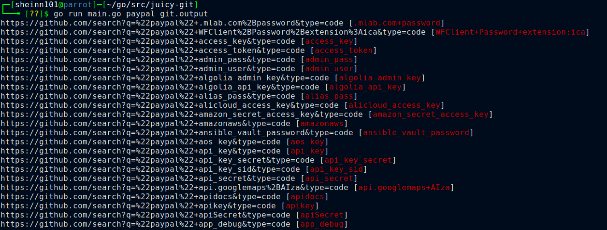
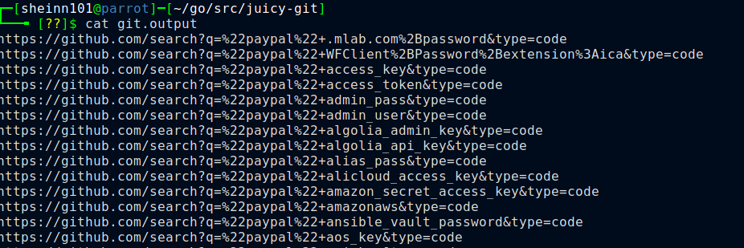

# juicy-git
I've created this stupid tool to generate a bunch of github dorks list and
You can check manually or copy the ouput and use bulk url open addon , Open Multiple Url addon
to find sensitive information disclose from github.

## Usage 
```
juicy-git org:paypal output.txt
juicy-git paypal output.txt
```

## Installation
```
go get github.com/0xsheinn/juicy-git
```

## POC



